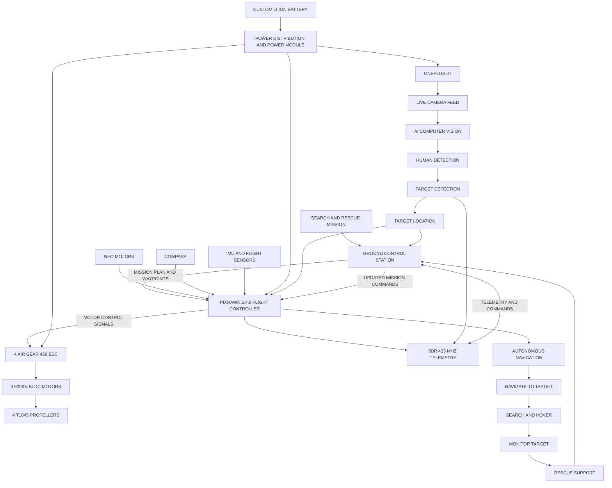
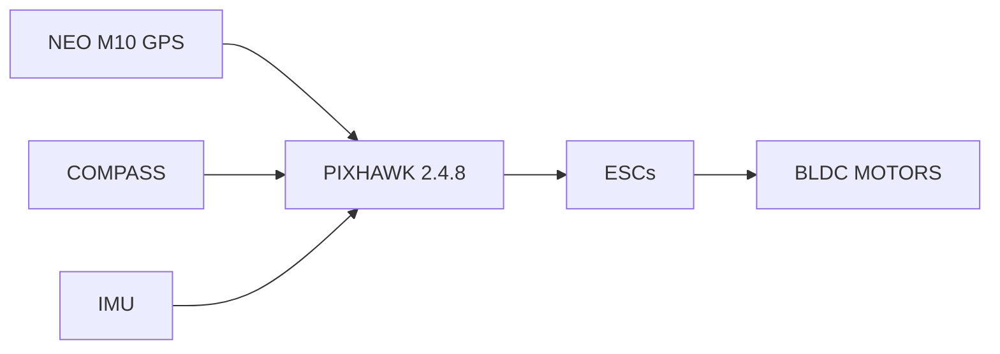
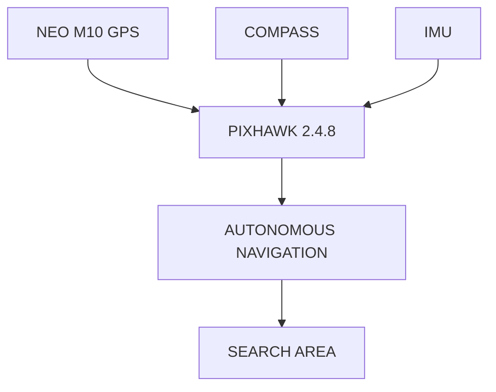
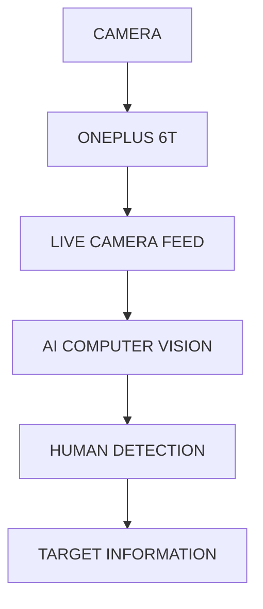
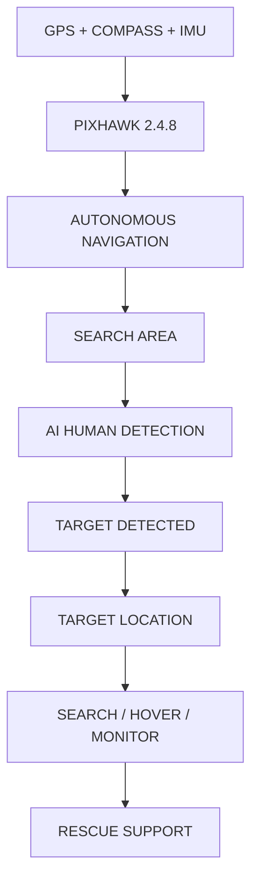
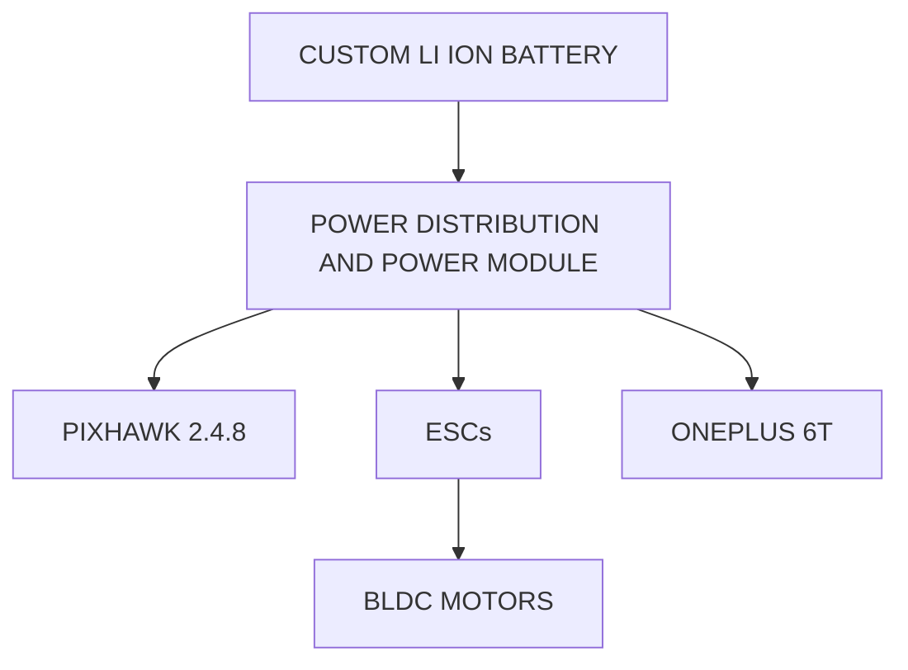
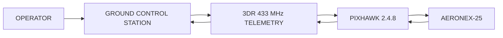
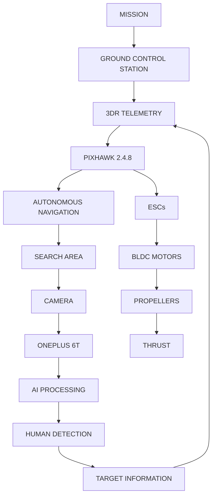
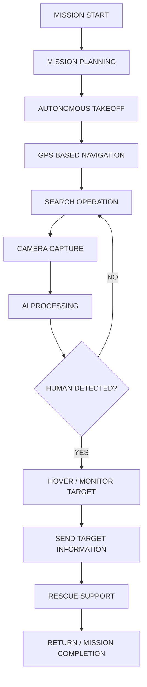

#  NIRMAAN_AERONEX-26

## AI-POWERED SEARCH AND RESCUE OPERATION DRONE

### NIRMAAN 2026
**Build. Innovate. Impact.**

---

##  TEAM INFORMATION

**Team Name:** NIRMAAN_AERONEX-26

**Team Leader:** ASHWATH YADAV

**Chosen Track:** Smart Mobility & Aerospace​

**Problem Statement:**  
Development of an AI-powered aerial search and rescue system capable of assisting rescue teams in locating and identifying people in emergency and disaster situations.

---

# 1.  PROBLEM STATEMENT & REAL-WORLD IMPACT

## The Problem

During natural disasters, accidents, building collapses, floods, fires, and other emergency situations, locating people quickly can be difficult and dangerous.

Traditional search and rescue operations may require:

- Large numbers of rescue personnel
- Significant time to cover large areas
- Access to difficult or unsafe terrain
- Manual visual inspection
- Continuous communication between field teams

Areas with limited accessibility can significantly increase the time required to locate survivors.

### Why aerial assistance is required

A drone can provide:

- Rapid aerial coverage
- Access to difficult terrain
- Real-time aerial observation
- Reduced risk to human rescuers
- Faster identification of potential survivors

---

## Target Audience

The proposed system is intended to assist:

- Search and rescue teams
- Disaster response teams
- Emergency response organizations
- Fire and rescue departments
- Disaster management authorities
- Humanitarian response teams

---

## Current Gaps & Impact

### Current Gaps

Existing manual search operations can face:

- Limited area coverage
- Dependence on human visual inspection
- Difficult terrain accessibility
- Increased search time
- Risk to rescue personnel
- Difficulty maintaining continuous aerial surveillance

### Impact

AERONEX aims to support rescue operations by providing an aerial platform capable of:

**SEARCH → DETECT → LOCATE → REPORT**

This can help rescue personnel make faster and more informed decisions during emergency situations.

---

# 2. PROPOSED SOLUTION & INNOVATION

## Core Solution

AERONEX is an AI-powered search and rescue drone that combines:

- Autonomous flight
- GPS-based navigation
- Aerial imaging
- AI-based human detection
- Real-time telemetry
- Flight-controller-based stabilization
- Long-range radio communication

The drone is designed to autonomously navigate a defined search area while the onboard camera and AI processing system assist in identifying potential humans.

---

## Innovation Factor

The key innovation of AERONEX is the integration of an autonomous aerial platform with AI-based human detection for search and rescue applications.

Instead of relying entirely on manual visual inspection, the system is designed to assist in identifying potential survivors from aerial imagery.

### Innovation Highlights

- AI-assisted human detection
- Autonomous waypoint navigation
- GPS-based positioning
- Real-time telemetry
- Onboard mobile computing using a smartphone
- Integrated aerial surveillance
- Modular and scalable hardware architecture

---

# 3.  KEY FEATURES

###  Autonomous Navigation

The drone uses a flight controller and GPS system for autonomous waypoint-based navigation.

###  AI-Based Human Detection

The camera system provides aerial images/video for AI-based detection of people in the search area.

###  GPS Positioning

GPS provides location information required for navigation and mission planning.

###  Real-Time Telemetry

Telemetry enables communication between the ground station and the drone for monitoring flight and mission information.

###  Aerial Surveillance

The onboard camera provides an aerial view of the search environment.

###  Manual Override

The radio transmitter and receiver provide manual control capability when required.

###  Stable Flight Platfor
## AI POWERED SEARCH AND RESCUE OPERATION DRONE

AERONEX-25 is an AI-powered autonomous search and rescue drone designed to assist in locating and monitoring people during emergency situations.

---

## AI Powered Search and Rescue Operation Drone

---

## System Architecture

---

## System Overview

OUR DRONE is an AI powered search and rescue operation drone integrating autonomous flight, GPS navigation, AI based human detection, real time telemetry and rescue support.

## MAIN SUBSYSTEMS

- Flight Control System
- Navigation System
- AI Search and Detection System
- Propulsion System
- Power Management System
- Communication System
- Ground Control System

---

## FLIGHT CONTROL SYSTEM

The Pixhawk 2.4.8 acts as the main flight controller.

It receives navigation and sensor information from the GPS, compass, and IMU and generates control signals for the ESCs.

### Components

| Component | Function |
|---|---|
| Pixhawk 2.4.8 | Flight control and autonomous navigation |
| NEO M10 GPS | Position and navigation |
| Compass | Heading information |
| IMU | Attitude and motion sensing |

### Flight Control Flow

---

## NAVIGATION SYSTEM

The navigation system uses GPS, compass, and IMU information to support autonomous flight and position-based navigation.

---

## PROPULSION SYSTEM

The propulsion system converts electrical power into mechanical thrust.

### Propulsion Components

| Component | Function |
|---|---|
| AIR GEAR 450 ESC | Controls motor speed |
| 920KV BLDC Motors | Generates rotational power |
| T1045 Propellers | Generates thrust |
| Pixhawk 2.4.8 | Provides motor control signals |

---

## AI SEARCH AND DETECTION SYSTEM

The OnePlus 6T is used for camera input and AI processing.

---

## NAVIGATION AND TARGET FLOW

---

## COMMUNICATION SYSTEM

The 3DR 433 MHz telemetry system provides communication between the drone and Ground Control Station.

---

## POWER MANAGEMENT SYSTEM

The custom Li-ion battery supplies power to the drone through the power distribution and power module.

---

## GROUND CONTROL SYSTEM

The Ground Control Station communicates with the Pixhawk through 3DR telemetry.

---

## POWER FLOW

---

## OVERALL SYSTEM DATA FLOW

---

## MISSION WORKFLOW

---

## MAIN HARDWARE COMPONENTS

| Component | Purpose |
|---|---|
| Pixhawk 2.4.8 | Flight controller |
| NEO M10 GPS | Position information |
| Compass | Heading information |
| IMU | Attitude and motion sensing |
| OnePlus 6T | Camera and AI computing |
| AIR GEAR 450 ESC | Motor speed control |
| 920KV BLDC Motors | Drone propulsion |
| T1045 Propellers | Thrust generation |
| Custom Li-ion Battery | Power source |
| Power Distribution / Power Module | Power distribution |
| 3DR 433 MHz Telemetry | Communication |

---

## KEY FEATURES

- AI-powered human detection
- Autonomous flight
- GPS-based navigation
- Real-time telemetry
- Ground Control Station communication
- Onboard camera and AI processing
- Autonomous search and monitoring
- Target detection
- Rescue support
- Integrated propulsion and power system

---

## PROJECT OBJECTIVE

The objective of AERONEX-25 is to provide an aerial platform capable of assisting search and rescue operations by combining autonomous flight, AI-based human detection, aerial surveillance, and real-time communication.

The system is designed to support search teams by providing aerial observation and target information over search areas.

---

---

## PROJECT SUMMARY

**Project Name:** NIRMAAN_AERONEX-25

**Project Type:** AI Powered Search and Rescue Operation Drone

**Platform:** Autonomous Quadcopter

**Flight Controller:** Pixhawk 2.4.8

**AI Computing:** OnePlus 6T

**Communication:** 3DR 433 MHz Telemetry

**Navigation:** NEO M10 GPS + Compass + IMU

**Propulsion:** 4 × 920KV BLDC Motors + 4 × T1045 Propellers

**ESC:** 4 × AIR GEAR 450 ESCs

---

## CONCLUSION

AERONEX-25 integrates autonomous flight, GPS navigation, AI-based human detection, onboard computing, telemetry, propulsion, and power management into a unified aerial search and rescue platform.

The modular architecture allows the major subsystems to work together for autonomous search, human detection, monitoring, and rescue support.
